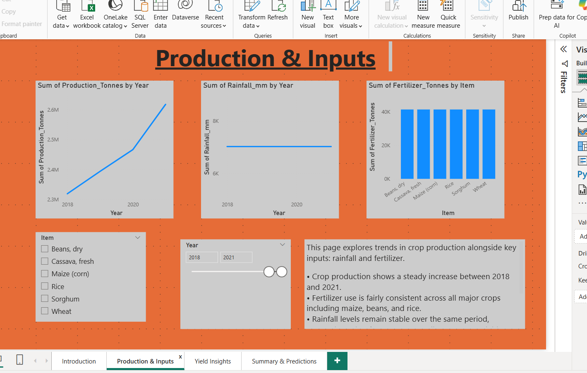
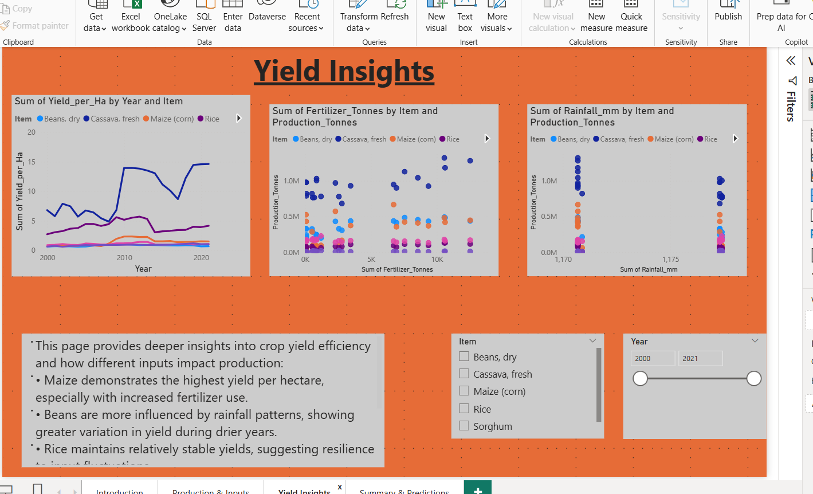
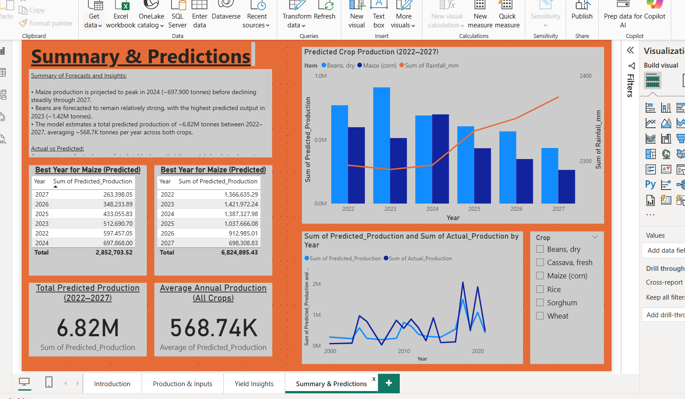

# agriculture-yield-analysis-final-project
Analyzing factors affecting maize &amp; bean yields in Rwanda (2000–2027) — Python &amp; Power BI capstone project.”

#  README – Agricultural Crop Yield Analysis in Rwanda (2000–2027)

###  Student: **Kabucye Kelly**  
**Institution:** Adventist University of Central Africa (AUCA)  
**Faculty:** Information Technology  
**Course Code:** INSY 8413  
**Course Name:** Introduction to Big Data Analytics  
**Lecturer:** Eric Maniraguha  
**Capstone Group:** E  
**Academic Year:** 2024–2025, Semester III

### Contact Information
- **Student Email:** kel.kabucye@gmail.com  
- **Lecturer Email:** eric.maniraguha@auca.ac.rw

---

##  Project Title
**Analyzing Factors Affecting Crop Production in Rwanda (2000–2027)**

---

##  Problem Statement & Motivation

Agricultural production is critical to Rwanda’s economy and food security, yet crop yields are highly sensitive to environmental factors such as rainfall and input usage like fertilizer and land area. Policymakers and farmers often lack timely, data-driven tools to forecast trends and make informed decisions.

This project aims to explore historical data on rainfall, fertilizer use, and land area to understand their effects on crop yield — focusing on Rwanda's key staple crops: **maize** and **beans**. The ultimate goal is to develop predictive models and visual dashboards that support smarter resource allocation and agricultural planning, especially under changing climate conditions.

---

## Project Scope

### Python Components:
- Dataset merging and cleaning using **Pandas**
- Exploratory Data Analysis (EDA) with **Seaborn** and **Matplotlib**
- Linear regression modeling using **scikit-learn**
- Prediction of crop yields from 2022–2027
- Output saved to CSV for Power BI

### Power BI Components:
- 4-page interactive dashboard
- Slicers for crop and year selection
- Visuals for production trends, rainfall, fertilizer usage, and yield efficiency
- Forecast summary with KPI cards and prediction charts

---

## Files Included

| File | Description |
|------|-------------|
| [agriculture_yield_analysis.ipynb](agriculture_yield_analysis.ipynb) | Full Python workflow: cleaning → modeling → forecasting |
| [cleaned_agriculture_data.xls](cleaned_agriculture_data.xls) | Merged and cleaned dataset (2000–2021) |
| [predicted_production_2022_2027.xls](predicted_production_2022_2027.xls) | Forecast data for maize and beans |
| [dashboard.pbix](dashboard.pbix) | Power BI dashboard file |
| [capstone_presentation.pptx](capstone_presentation.pptx) | 8-slide summary presentation |
|  | Dashboard Page 2 |
|  | Dashboard Page 3 |
|  | Dashboard Page 4 |
| [README.md](README.md) | This file |

---

## Dataset Source

All datasets were collected from **approved non-Kaggle sources**:

- **FAOStat**: [https://www.fao.org/faostat](https://www.fao.org/faostat)  
  (for crop production, area harvested, fertilizer consumption)  
- **World Bank Climate Data API**: [https://climateknowledgeportal.worldbank.org/](https://climateknowledgeportal.worldbank.org/)  
  (for annual rainfall in Rwanda)

---

##  How to Run This Project

### 1. Python
- Open the notebook: `agriculture_yield_analysis.ipynb`
- Run all cells (requires `pandas`, `matplotlib`, `scikit-learn`)
- Outputs will be saved in `/data/`

### 2. Power BI
- Open `dashboard.pbix` in Power BI Desktop
- Interact with slicers and visuals for insights

---

## Summary of Deliverables

✔ PowerPoint Presentation  
✔ Python notebook with data cleaning, modeling & predictions  
✔ Power BI dashboard with all interactive components  
✔ All included in GitHub repository

---

## 📧 Submission Notice
This README is intended for submission alongside:
- 📎 `project_presentation.pptx`
-  GitHub repository link containing all project files

